# 021 基于uniapp的中医药应用微信小程序-设计展示

> **代码有偿获取 可接受定制 微信联系方式: ACE2487，备注(BS)**

> 

## 介绍

UniApp是一款使用Vue.js开发所有前端应用的框架，能够同时在iOS、Android、H5、小程序等多个平台上运行；所以本系统可以是一个安卓app，也可以是微信小程序

系统包括以下功能：

中药资讯 中药材 症候分析 中药方剂 个人中心 根据症状推荐中药材 后台管理数据

## 技术栈

python django vue uniapp scrapy 安卓app 微信小程序 网页H5 uview 中药资讯 中药材 症候分析 中药方剂 个人中心 根据症状推荐中药材 后台管理数据

## 视频

> **点击查看 \>\>\> [https://www.bilibili.com/video/BV19Y4y1Q7me/](https://www.bilibili.com/video/BV19Y4y1Q7me/)**

## 截图

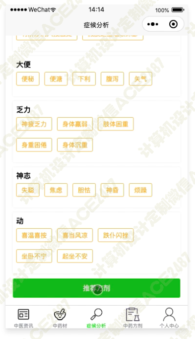
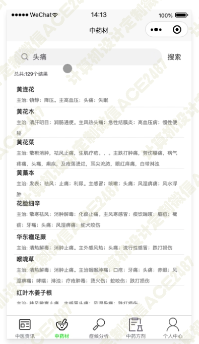
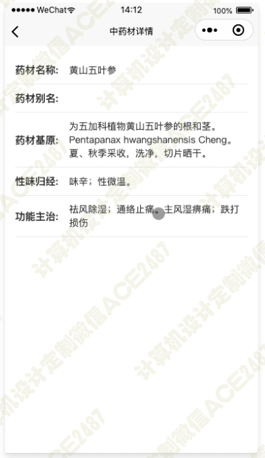
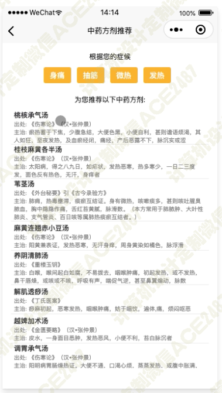
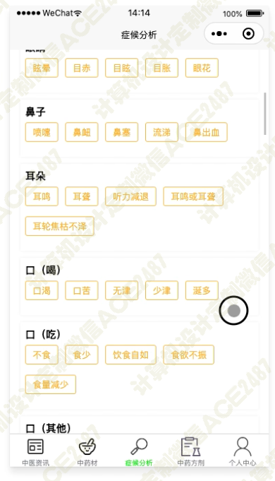
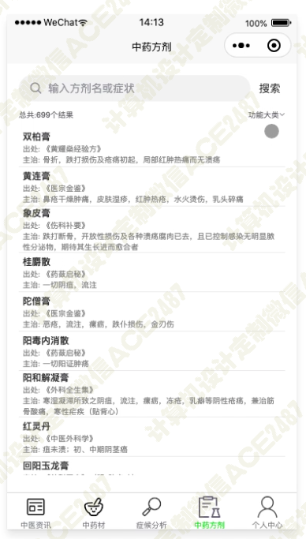
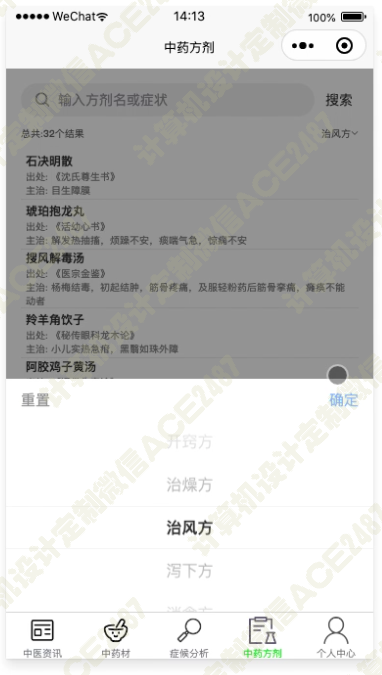
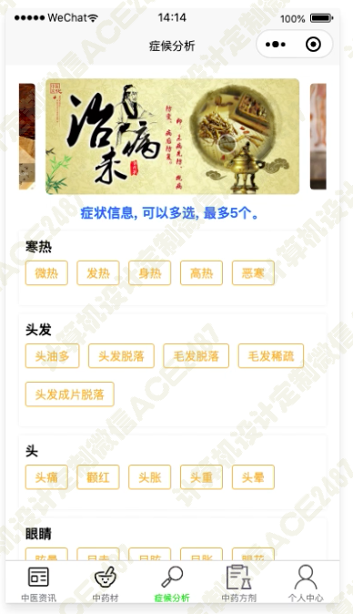
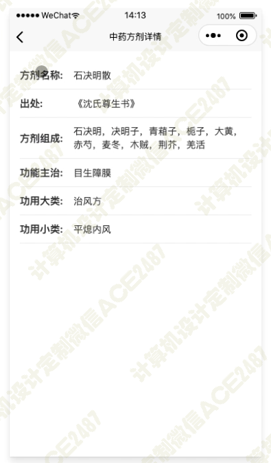
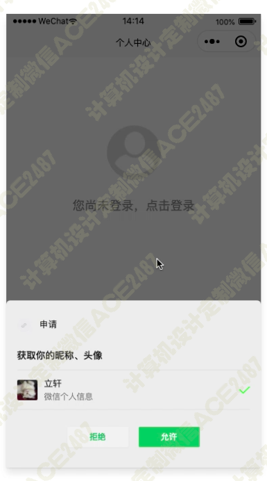
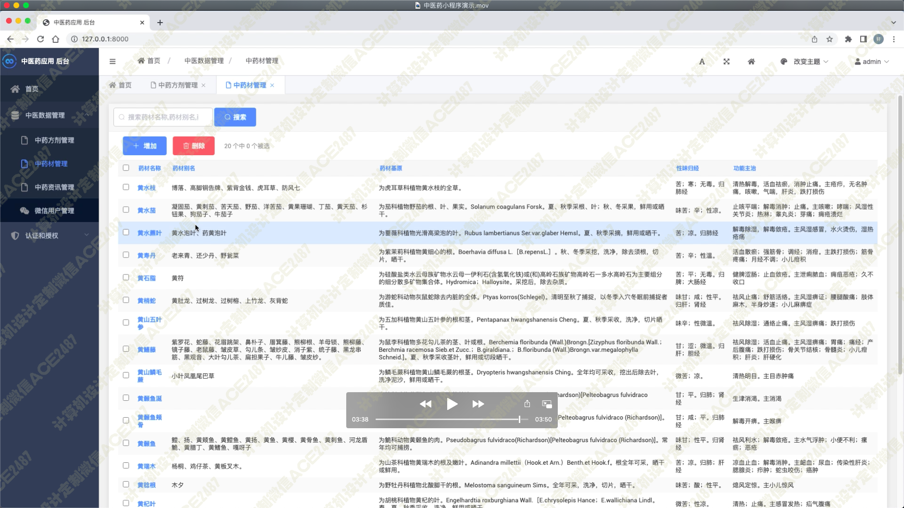
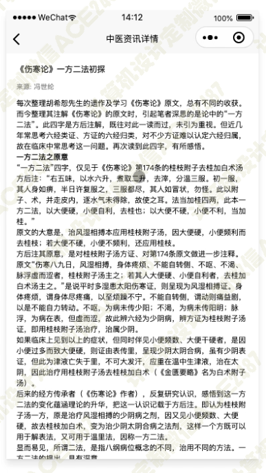
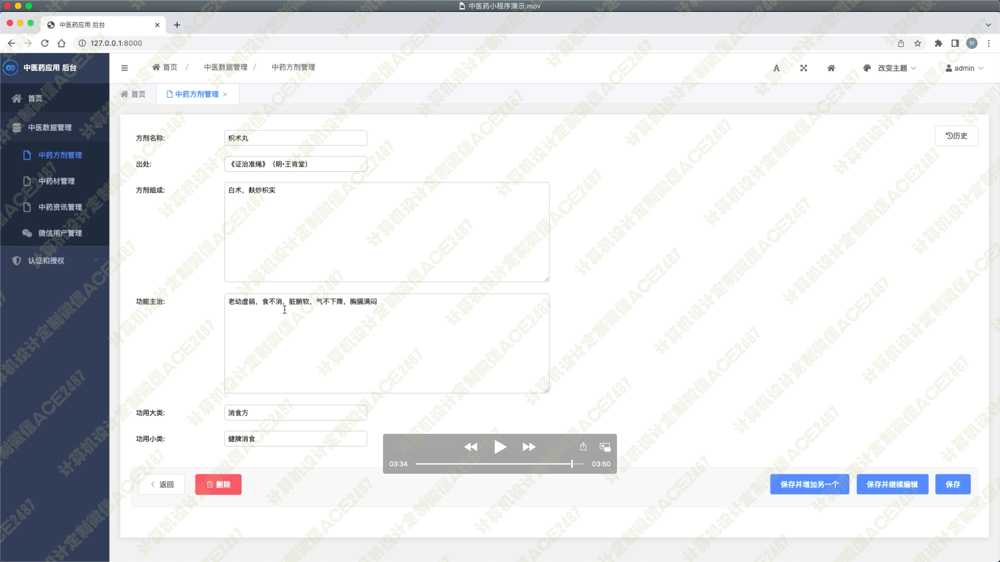
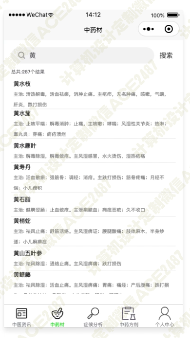
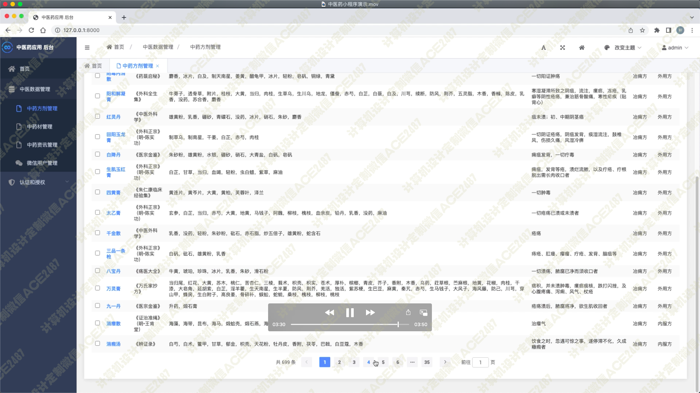
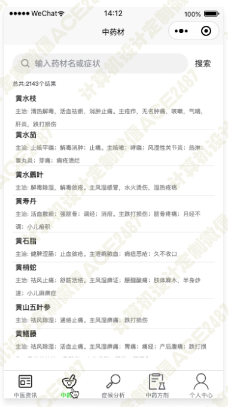
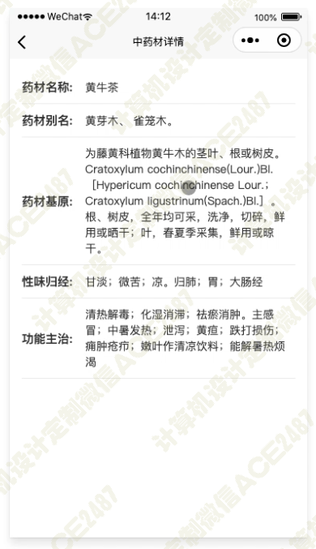
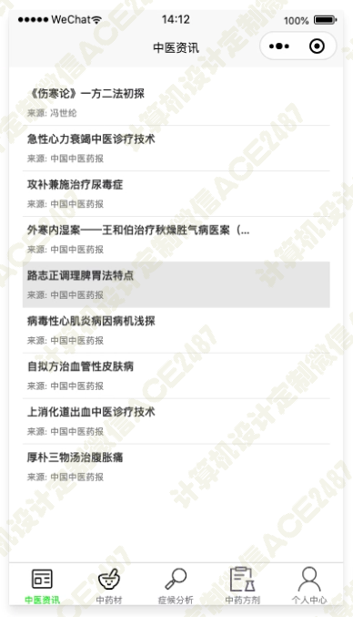
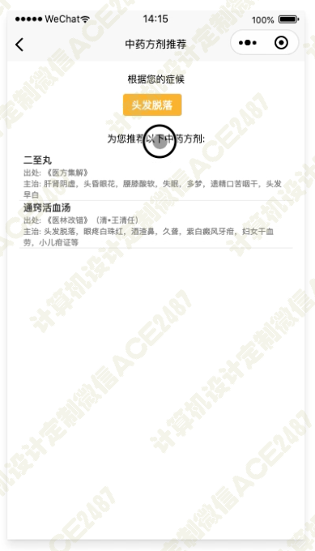
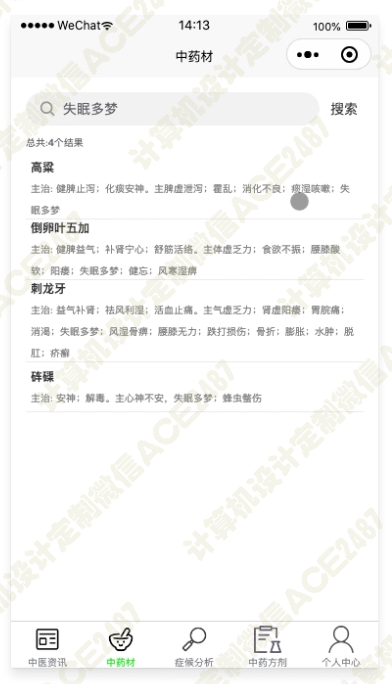